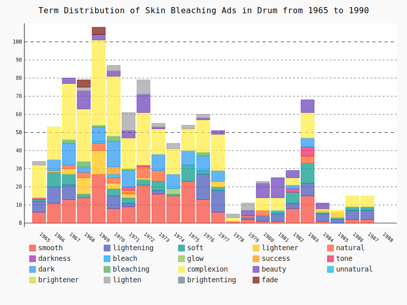
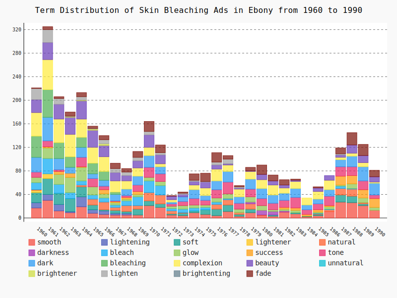
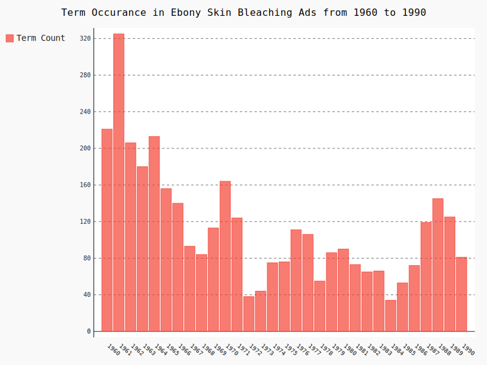
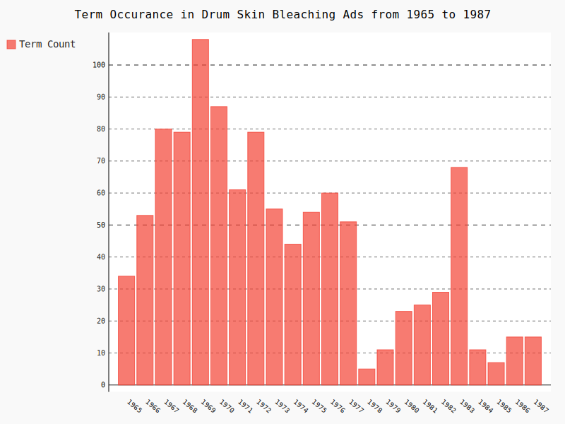
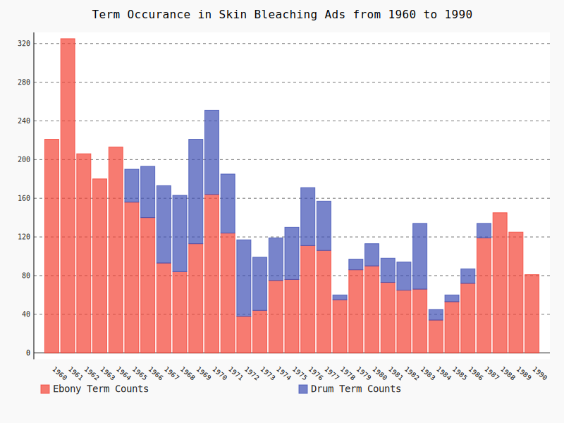
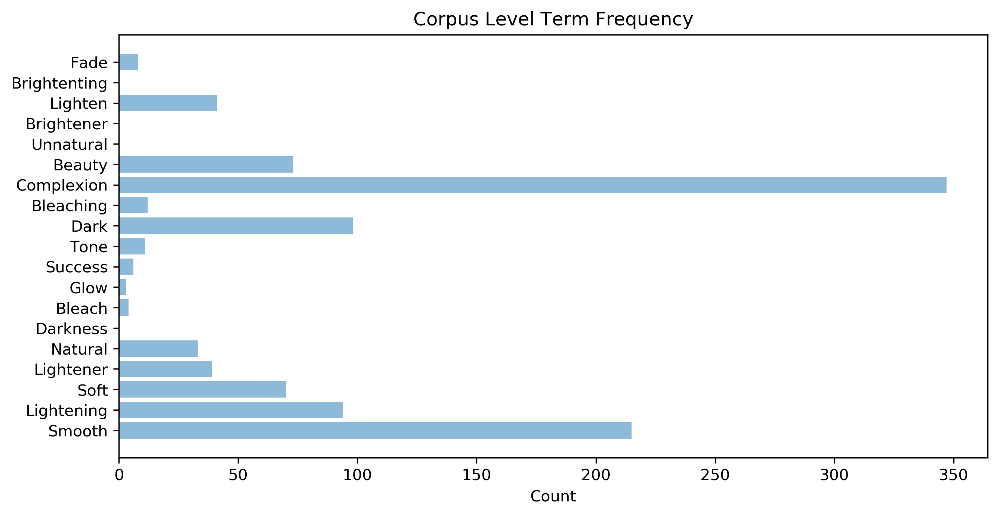
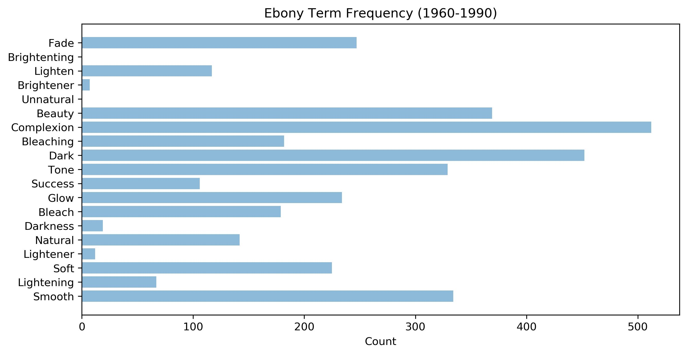
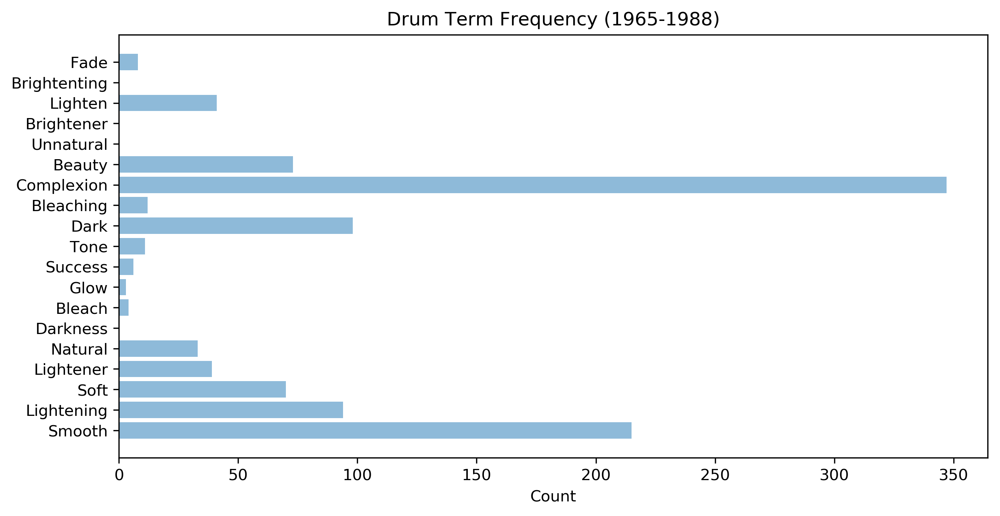
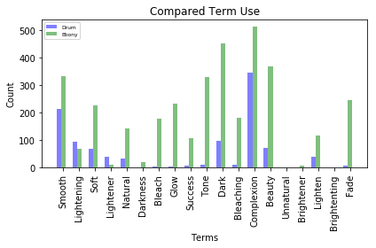

# Drum and Ebony Skin Bleaching Ads


```python
import pandas as pd
import numpy as np
import matplotlib.pyplot as plt
from IPython.display import SVG, display
import os
import sys
import csv
import nltk
from string import punctuation
import pygal
#pd.set_option('display.mpl_style', 'default')
```


```python
ebony = pd.read_csv("Ebony.skin.ads.1960-1990.csv", parse_dates=True, index_col='Year')
ebony.head()
#ebony.tail()
```


<div>
<style scoped>
    .dataframe tbody tr th:only-of-type {
        vertical-align: middle;
    }

    .dataframe tbody tr th {
        vertical-align: top;
    }

    .dataframe thead th {
        text-align: right;
    }
</style>
<table border="1" class="dataframe">
  <thead>
    <tr style="text-align: right;">
      <th></th>
      <th>Region</th>
      <th>Source</th>
      <th>Product name</th>
      <th>chemical/active ingredient</th>
      <th>Structure</th>
      <th>Chemistry</th>
      <th>Claims</th>
      <th>Legal issues and Politics</th>
      <th>Race</th>
      <th>Age</th>
      <th>Advertising strategy *quotes-catch phrase*</th>
      <th>Size of Advert</th>
      <th>Pg reference (quentin marked)</th>
      <th>Notes</th>
    </tr>
    <tr>
      <th>Year</th>
      <th></th>
      <th></th>
      <th></th>
      <th></th>
      <th></th>
      <th></th>
      <th></th>
      <th></th>
      <th></th>
      <th></th>
      <th></th>
      <th></th>
      <th></th>
      <th></th>
    </tr>
  </thead>
  <tbody>
    <tr>
      <th>1960-01-01</th>
      <td>NaN</td>
      <td>Ebony</td>
      <td>Long Aid Bleach and Glow</td>
      <td>unnamed</td>
      <td>NaN</td>
      <td>NaN</td>
      <td>" - wakes up dark, dull complexion! Conceals u...</td>
      <td>NaN</td>
      <td>NaN</td>
      <td>NaN</td>
      <td>NaN</td>
      <td>1/2 pg</td>
      <td>63</td>
      <td>small part of 1.2 pg ad for Long Aid hair prod...</td>
    </tr>
    <tr>
      <th>1960-01-01</th>
      <td>NaN</td>
      <td>NaN</td>
      <td>Mercolized Wax Cream</td>
      <td>ammoniated mercury; zinc oxide</td>
      <td>NaN</td>
      <td>NaN</td>
      <td>"If your skin doesn't look actually lighter af...</td>
      <td>NaN</td>
      <td>NaN</td>
      <td>NaN</td>
      <td>"Mercolized Wax Cream guarantees lighter looki...</td>
      <td>1/4 pg</td>
      <td>72</td>
      <td>ingredient on image of product; not mentioned ...</td>
    </tr>
    <tr>
      <th>1960-01-01</th>
      <td>NaN</td>
      <td>NaN</td>
      <td>Black and White Bleaching Cream</td>
      <td>unnamed</td>
      <td>NaN</td>
      <td>NaN</td>
      <td>"And you, too, can have a glamorous complexion...</td>
      <td>NaN</td>
      <td>NaN</td>
      <td>NaN</td>
      <td>"Lighter, brighter skin is irresistable"</td>
      <td>1/8 pg</td>
      <td>83</td>
      <td>drawing of white man and white woman in ad</td>
    </tr>
    <tr>
      <th>1960-01-01</th>
      <td>NaN</td>
      <td>NaN</td>
      <td>Nadinola Bleaching Cream</td>
      <td>"wonder-working A-M"</td>
      <td>NaN</td>
      <td>NaN</td>
      <td>"Don't let dull, dark skin rob you of romance....</td>
      <td>NaN</td>
      <td>NaN</td>
      <td>NaN</td>
      <td>"LIFE IS MORE FUN when your complexion is clea...</td>
      <td>full pg</td>
      <td>91</td>
      <td>two types advertised - oily and dry skin</td>
    </tr>
    <tr>
      <th>1960-01-01</th>
      <td>NaN</td>
      <td>NaN</td>
      <td>Dr. Fred Palmer's Double Strength Skin Whitener</td>
      <td>zinc phenolsulfonate</td>
      <td>NaN</td>
      <td>NaN</td>
      <td>"Yes in just 7 days be delighted how fast and ...</td>
      <td>NaN</td>
      <td>NaN</td>
      <td>NaN</td>
      <td>"DR. FRED PALMER'S IN JUST 7 DAYS MUST GIVE YO...</td>
      <td>1/8 pg</td>
      <td>108</td>
      <td>NaN</td>
    </tr>
  </tbody>
</table>
</div>


```python
drum = pd.read_csv("Drum_Skin_Lighteners_1965_1988.csv", parse_dates=True, index_col='Year')
drum.head(5)
```


<div>
<style scoped>
    .dataframe tbody tr th:only-of-type {
        vertical-align: middle;
    }

    .dataframe tbody tr th {
        vertical-align: top;
    }

    .dataframe thead th {
        text-align: right;
    }
</style>
<table border="1" class="dataframe">
  <thead>
    <tr style="text-align: right;">
      <th></th>
      <th>Product name</th>
      <th>chemical/active ingredient</th>
      <th>Claims</th>
      <th>Legal issues and Politics</th>
      <th>Race</th>
      <th>Age</th>
      <th>Advertising strategy *quotes-catch phrase*</th>
      <th>Size of Advert</th>
      <th>Pg. reference ( marked)</th>
      <th>Notes</th>
    </tr>
    <tr>
      <th>Year</th>
      <th></th>
      <th></th>
      <th></th>
      <th></th>
      <th></th>
      <th></th>
      <th></th>
      <th></th>
      <th></th>
      <th></th>
    </tr>
  </thead>
  <tbody>
    <tr>
      <th>1965-01-01</th>
      <td>ARTRA skin tone cream</td>
      <td>Hydroquinone</td>
      <td>…to make their skin lighter and lovelier…lovel...</td>
      <td>Black model and white pharmacist/doctor</td>
      <td>Black</td>
      <td>20+</td>
      <td>Lighter, lovelier skin today…the American way!'</td>
      <td>full pg.</td>
      <td>pg. 2</td>
      <td>The ad says that the cream was developed after...</td>
    </tr>
    <tr>
      <th>1965-01-01</th>
      <td>NaN</td>
      <td>NaN</td>
      <td>brightens skin.' '…lightens from the first day...</td>
      <td>n/a</td>
      <td>NaN</td>
      <td>NaN</td>
      <td>Cream your skin lighter and brighter with ama...</td>
      <td>NaN</td>
      <td>pg. 2</td>
      <td>Ad states that it is a medicated beauty bar. S...</td>
    </tr>
    <tr>
      <th>1965-01-01</th>
      <td>NaN</td>
      <td>NaN</td>
      <td>immediately.' '…keeps skin beautiful and clean...</td>
      <td>NaN</td>
      <td>NaN</td>
      <td>NaN</td>
      <td>NaN</td>
      <td>NaN</td>
      <td>NaN</td>
      <td>NaN</td>
    </tr>
    <tr>
      <th>1965-01-01</th>
      <td>Artra beauty bar</td>
      <td>Hydroquinone</td>
      <td>…mild and gentle…keeps skin free from blemishe...</td>
      <td>NaN</td>
      <td>NaN</td>
      <td>20+</td>
      <td>Medicated soap for complexion care</td>
      <td>NaN</td>
      <td>NaN</td>
      <td>NaN</td>
    </tr>
    <tr>
      <th>1965-01-01</th>
      <td>Aloma Crème blanche</td>
      <td>unnamed</td>
      <td>…clears and lightens the skin, smooth's away b...</td>
      <td>Black model</td>
      <td>Black</td>
      <td>20-35</td>
      <td>good things happen to a pretty girl</td>
      <td>full pg.</td>
      <td>NaN</td>
      <td>Ad states that using this product will increas...</td>
    </tr>
  </tbody>
</table>
</div>


## Terms 


```python
years_ebony = ebony.index
years_ebony = set(years_ebony.year)
```


```python
years_drum = drum.index
years_drum = set(years_drum.year)
```


```python
claims_ebony = ebony["Claims"]
claims_drum = drum['Claims']
terms = {
"bleach",
"bleaching",
"lightening",
"lighten",
"lightener",
"glow",
"tone",
"smooth",
"beauty",
"fade",
"brightenting",
"brightener",
"dark", 
"darkness",
"natural", 
"unnatural",
"soft",
"success",
"complexion"
}
```


```python
claims_drum = claims_drum.dropna()
```


```python
claims_ebony = claims_ebony.dropna()
#claims_drum.replace(',','',regex = True) 
```


```python
claims_drum_sents = []
i = 0
for claim in claims_drum:
    temp_claim = "".join([ch for ch in claim if (ch.isalpha() or ch == " ") and ch not in punctuation]).lower()
    claims_drum_sents.append((str(claims_drum.keys()[i]),temp_claim))
    i += 1
```


```python
claims_ebony_sents = []
i = 0
for claim in claims_ebony:
    temp_claim = "".join([ch for ch in claim if (ch.isalpha() or ch == " ") and ch not in punctuation]).lower()
    claims_ebony_sents.append((str(claims_ebony.keys()[i]),temp_claim))
    i += 1
```


```python
drum_term_counts = {}
ebony_term_counts = {}
for term in terms:
    temp_term = []
    for year in years_ebony:
        e = 0
        for y,c in claims_ebony_sents:
            if str(year) == y[:4]:
                if term in c.split():
                    e += 1
        temp_term.append(e)
    ebony_term_counts[term] = temp_term
    temp_term = []
    for year in years_drum:
        e = 0
        for y,c in claims_drum_sents:
            if str(year) == y[:4]:
                if term in c.split():
                    e += 1
        temp_term.append(e)
    drum_term_counts[term] = temp_term
print("Ebony Term Counts")
print(ebony_term_counts)
print("-"*100)
print("Drum Term Counts")
print(drum_term_counts)
```

    Ebony Term Counts
    {'smooth': [17, 30, 12, 9, 19, 8, 6, 5, 5, 5, 21, 18, 5, 4, 9, 6, 4, 11, 3, 9, 4, 3, 10, 7, 2, 4, 11, 27, 26, 21, 13], 'lightening': [9, 10, 11, 2, 17, 6, 6, 3, 3, 0, 0, 0, 0, 0, 0, 0, 0, 0, 0, 0, 0, 0, 0, 0, 0, 0, 0, 0, 0, 0, 0], 'soft': [17, 27, 19, 22, 17, 8, 2, 5, 3, 10, 8, 6, 2, 4, 3, 8, 11, 11, 3, 6, 0, 2, 0, 2, 1, 2, 0, 12, 11, 3, 0], 'lightener': [4, 8, 0, 0, 0, 0, 0, 0, 0, 0, 0, 0, 0, 0, 0, 0, 0, 0, 0, 0, 0, 0, 0, 0, 0, 0, 0, 0, 0, 0, 0], 'natural': [1, 0, 0, 0, 3, 10, 13, 5, 10, 6, 14, 15, 5, 1, 0, 0, 8, 9, 3, 9, 1, 0, 0, 0, 0, 1, 3, 11, 12, 2, 0], 'darkness': [0, 0, 0, 0, 0, 0, 0, 0, 0, 0, 0, 0, 0, 0, 0, 0, 0, 0, 0, 3, 8, 6, 2, 0, 0, 0, 0, 0, 0, 0, 0], 'bleach': [12, 26, 15, 10, 7, 7, 7, 4, 8, 15, 20, 16, 4, 6, 5, 4, 4, 2, 0, 0, 0, 0, 0, 0, 0, 1, 1, 4, 1, 0, 0], 'glow': [9, 18, 17, 26, 23, 14, 7, 4, 3, 4, 6, 7, 4, 6, 5, 4, 7, 8, 6, 9, 8, 3, 3, 4, 0, 2, 4, 2, 8, 8, 5], 'success': [0, 2, 5, 7, 1, 0, 7, 2, 3, 5, 0, 0, 0, 0, 0, 0, 0, 0, 0, 0, 0, 0, 3, 4, 3, 4, 2, 15, 14, 14, 15], 'tone': [9, 10, 3, 0, 16, 14, 6, 1, 3, 11, 17, 13, 4, 7, 11, 8, 14, 20, 10, 13, 12, 11, 12, 18, 8, 10, 16, 16, 15, 15, 6], 'dark': [25, 40, 19, 10, 17, 8, 10, 11, 11, 15, 20, 12, 3, 8, 15, 8, 15, 18, 11, 17, 17, 14, 12, 15, 8, 8, 11, 12, 18, 24, 20], 'bleaching': [36, 47, 27, 18, 17, 18, 15, 4, 0, 0, 0, 0, 0, 0, 0, 0, 0, 0, 0, 0, 0, 0, 0, 0, 0, 0, 0, 0, 0, 0, 0], 'complexion': [40, 51, 40, 38, 31, 27, 25, 19, 14, 14, 14, 5, 4, 0, 8, 13, 20, 11, 13, 13, 15, 17, 9, 12, 12, 13, 16, 4, 5, 7, 2], 'beauty': [22, 29, 25, 29, 31, 29, 19, 14, 9, 12, 21, 15, 6, 4, 6, 10, 7, 2, 2, 1, 9, 7, 5, 2, 0, 6, 8, 4, 14, 12, 9], 'unnatural': [0, 0, 0, 0, 0, 0, 0, 0, 0, 0, 0, 0, 0, 0, 0, 0, 0, 0, 0, 0, 0, 0, 0, 0, 0, 0, 0, 0, 0, 0, 0], 'brightener': [0, 0, 0, 1, 1, 2, 3, 0, 0, 0, 0, 0, 0, 0, 0, 0, 0, 0, 0, 0, 0, 0, 0, 0, 0, 0, 0, 0, 0, 0, 0], 'lighten': [19, 22, 10, 1, 6, 1, 7, 7, 6, 6, 6, 4, 0, 2, 2, 1, 5, 8, 2, 0, 0, 0, 0, 0, 0, 0, 0, 2, 0, 0, 0], 'brightenting': [0, 0, 0, 0, 0, 0, 0, 0, 0, 0, 0, 0, 0, 0, 0, 0, 0, 0, 0, 0, 0, 0, 0, 0, 0, 0, 0, 0, 0, 0, 0], 'fade': [1, 5, 3, 7, 7, 4, 7, 9, 6, 10, 17, 13, 1, 2, 11, 14, 16, 6, 2, 6, 16, 10, 9, 2, 0, 2, 0, 10, 21, 19, 11]}
    ----------------------------------------------------------------------------------------------------
    Drum Term Counts
    {'smooth': [6, 11, 13, 14, 27, 8, 9, 21, 16, 15, 23, 13, 6, 1, 2, 1, 1, 8, 15, 1, 0, 2, 2], 'lightening': [6, 9, 8, 0, 0, 7, 2, 0, 2, 0, 0, 14, 12, 0, 1, 3, 4, 3, 7, 4, 2, 5, 5], 'soft': [1, 8, 6, 2, 0, 4, 3, 3, 5, 1, 9, 2, 2, 0, 0, 0, 1, 6, 11, 1, 1, 2, 2], 'lightener': [0, 0, 3, 9, 13, 3, 2, 1, 0, 0, 0, 0, 3, 0, 0, 0, 0, 0, 0, 2, 3, 0, 0], 'natural': [0, 0, 2, 3, 4, 3, 1, 6, 6, 0, 0, 0, 0, 0, 1, 3, 0, 0, 4, 0, 0, 0, 0], 'darkness': [0, 0, 0, 0, 0, 0, 0, 0, 0, 0, 0, 0, 0, 0, 0, 0, 0, 0, 0, 0, 0, 0, 0], 'bleach': [0, 0, 0, 0, 1, 2, 0, 0, 0, 0, 0, 0, 0, 0, 0, 0, 1, 0, 0, 0, 0, 0, 0], 'glow': [0, 0, 0, 0, 0, 0, 0, 0, 0, 3, 0, 0, 0, 0, 0, 0, 0, 0, 0, 0, 0, 0, 0], 'success': [0, 1, 0, 0, 0, 4, 1, 0, 0, 0, 0, 0, 0, 0, 0, 0, 0, 0, 0, 0, 0, 0, 0], 'tone': [1, 0, 0, 0, 0, 0, 2, 1, 0, 0, 0, 0, 0, 0, 0, 0, 0, 2, 5, 0, 0, 0, 0], 'dark': [0, 6, 12, 3, 8, 14, 9, 0, 9, 8, 8, 8, 6, 0, 0, 0, 0, 2, 5, 0, 0, 0, 0], 'bleaching': [0, 0, 2, 3, 1, 3, 1, 0, 0, 0, 0, 2, 0, 0, 0, 0, 0, 0, 0, 0, 0, 0, 0], 'complexion': [18, 18, 31, 29, 47, 33, 17, 29, 14, 14, 12, 18, 20, 2, 0, 7, 7, 4, 14, 0, 1, 6, 6], 'beauty': [0, 0, 3, 10, 3, 3, 4, 10, 1, 0, 0, 1, 2, 0, 3, 8, 11, 4, 7, 3, 0, 0, 0], 'unnatural': [0, 0, 0, 0, 0, 0, 0, 0, 0, 0, 0, 0, 0, 0, 0, 0, 0, 0, 0, 0, 0, 0, 0], 'brightener': [0, 0, 0, 0, 0, 0, 0, 0, 0, 0, 0, 0, 0, 0, 0, 0, 0, 0, 0, 0, 0, 0, 0], 'lighten': [2, 0, 0, 2, 0, 3, 10, 8, 2, 3, 2, 2, 0, 2, 4, 1, 0, 0, 0, 0, 0, 0, 0], 'brightenting': [0, 0, 0, 0, 0, 0, 0, 0, 0, 0, 0, 0, 0, 0, 0, 0, 0, 0, 0, 0, 0, 0, 0], 'fade': [0, 0, 0, 4, 4, 0, 0, 0, 0, 0, 0, 0, 0, 0, 0, 0, 0, 0, 0, 0, 0, 0, 0]}


```python
line_chart = pygal.StackedBar(x_label_rotation=40, legend_at_bottom=True)
line_chart.title = 'Term Distribution of Skin Bleaching Ads in Drum from 1965 to 1990'
line_chart.x_labels = map(str, range(1965, 1989))
for term in terms:
    line_chart.add(term, drum_term_counts[term])
display(SVG(line_chart.render(disable_xml_declaration=True))) 
line_chart.render_to_file("drum_term_counts_by_year.svg")
```





```python
line_chart = pygal.StackedBar(x_label_rotation=40, legend_at_bottom=True)
line_chart.title = 'Term Distribution of Skin Bleaching Ads in Ebony from 1960 to 1990'
line_chart.x_labels = map(str, range(1960, 1991))
for term in terms:
    line_chart.add(term, ebony_term_counts[term])
display(SVG(line_chart.render(disable_xml_declaration=True))) 
line_chart.render_to_file("ebony_term_counts_by_year.svg")
```





```python
drum_counts = []
ebony_counts = []
for year in years_ebony:
    e = 0
    for y,c in claims_ebony_sents:
        if str(year) == y[:4]:
            e += 1
    ebony_counts.append(e)
    d = 0
    for y,c in claims_drum_sents:
        if str(year) == y[:4]:
            d += 1
    drum_counts.append(d)
print(ebony_counts)
print(drum_counts)
```

    [72, 103, 74, 82, 72, 58, 54, 36, 31, 34, 35, 24, 10, 9, 15, 22, 35, 39, 28, 31, 29, 32, 20, 24, 14, 20, 23, 34, 42, 41, 31]
    [0, 0, 0, 0, 0, 46, 62, 93, 108, 132, 134, 96, 80, 99, 60, 82, 65, 68, 6, 12, 22, 28, 25, 57, 15, 7, 10, 17, 0, 0, 0]


```python
line_chart = pygal.StackedBar(x_label_rotation=40, legend_at_bottom=True)
line_chart.title = 'Number of Skin Bleaching Ads in Ebony and Drum from 1960 to 1990'
line_chart.x_labels = map(str, range(1960, 1991))
line_chart.add("Ebony Total Ad Counts", ebony_counts)
line_chart.add("Drum Total Ad Counts", drum_counts)
display(SVG(line_chart.render(disable_xml_declaration=True))) 
line_chart.render_to_file("drum_and_ebony_ad_counts_by_year.svg")
```


```python
line_chart = pygal.StackedBar(x_label_rotation=40)
line_chart.title = 'Term Occurance in Ebony Skin Bleaching Ads from 1960 to 1990'
line_chart.x_labels = map(str, range(1960, 1991))
ebony_year_list = []
for year in years_ebony:
    i = 0
    for y,c in claims_ebony_sents:
        if str(year) == y[:4]:
            for term in terms:
                if term in c.split():
                    i += 1
    ebony_year_list.append(i)
line_chart.add("Term Count", ebony_year_list)
display(SVG(line_chart.render(disable_xml_declaration=True))) 
line_chart.render_to_file("ebony_term_occurance_by_year.svg")
```





```python
claims_drum = claims_drum.dropna()
#claims_drum.replace(',','',regex = True) 
```


```python
line_chart = pygal.StackedBar(x_label_rotation=40)
line_chart.title = 'Term Occurance in Drum Skin Bleaching Ads from 1965 to 1987'
line_chart.x_labels = map(str, range(1965, 1988))
drum_year_list = []
for year in years_drum:
    i = 0
    for y,c in claims_drum_sents:
        if str(year) == y[:4]:
            for term in terms:
                if term in c.split():
                    i += 1
    drum_year_list.append(i)
line_chart.add("Term Count", drum_year_list)
display(SVG(line_chart.render(disable_xml_declaration=True))) 
line_chart.render_to_file("drum_term_occurance_by_year.svg")
```





```python
fill = [None for n in range(0,5)]
```


```python
line_chart = pygal.StackedBar(x_label_rotation=40, legend_at_bottom=True)
line_chart.title = 'Term Occurance in Skin Bleaching Ads from 1960 to 1990'
line_chart.x_labels = map(str, range(1960, 1991))
line_chart.add("Ebony Term Counts", ebony_year_list)
line_chart.add("Drum Term Counts", fill+drum_year_list)
display(SVG(line_chart.render(disable_xml_declaration=True))) 
line_chart.render_to_file("drum_and_ebony_term_occurance_by_year.svg")
```





```python
def add(list_counts):
    total = 0
    for i in list_counts:
        total += i
    return total
```


```python
successfig = plt.figure(figsize=(10, 5), dpi=300)
objects = tuple([term.capitalize() for term in terms])
corpus_counts = dict(ebony_term_counts, **drum_term_counts)
termS1 = [add(count) for word,count in corpus_counts.items() if word in terms]
y_pos = np.arange(len(termS1))

plt.barh(y_pos, termS1, align='center', alpha=.5)
plt.yticks(y_pos, objects, fontsize = 10)
plt.xlabel('Count')
plt.title('Corpus Level Term Frequency')
 
plt.show()
successfig.savefig("corpus_freqs.png")
```





```python
successfig = plt.figure(figsize=(10, 5), dpi=300)
objects = tuple([term.capitalize() for term in terms])
termS1 = [add(count) for word,count in ebony_term_counts.items() if word in terms]
y_pos = np.arange(len(termS1))

plt.barh(y_pos, termS1, align='center', alpha=.5)
plt.yticks(y_pos, objects, fontsize = 10)
plt.xlabel('Count')
plt.title('Ebony Term Frequency (1960-1990)')
 
plt.show()
successfig.savefig("ebony_freqs.png")
```





```python
successfig = plt.figure(figsize=(10, 5), dpi=300)
objects = tuple([term.capitalize() for term in terms])
termS1 = [add(count) for word,count in drum_term_counts.items() if word in terms]
y_pos = np.arange(len(termS1))

plt.barh(y_pos, termS1, align='center', alpha=.5)
plt.yticks(y_pos, objects, fontsize = 10)
plt.xlabel('Count')
plt.title('Drum Term Frequency (1965-1988)')
 
plt.show()
successfig.savefig("drum_freqs.png")
```





```python
# data to plot
n_groups = len(objects)
fig = plt.figure(figsize=(20, 10), dpi=300)
# create plot
fig, ax = plt.subplots()
index = np.arange(n_groups)
bar_width = 0.28
opacity = 0.5

 
rects1 = plt.bar(index, [add(count) for word,count in drum_term_counts.items() if word in terms], bar_width,
                 alpha=opacity,
                 color='b',
                 label='Drum')
 
rects2 = plt.bar(index + bar_width, [add(count) for word,count in ebony_term_counts.items() if word in terms], bar_width,
                 alpha=opacity,
                 color='g',
                 label='Ebony')
 
plt.xlabel('Terms')
plt.ylabel('Count')
plt.title('Compared Term Use')
plt.xticks(index + bar_width, objects)
plt.xticks(rotation=90)
plt.legend(loc=2, prop={'size': 6})
 
plt.tight_layout()
plt.show()
fig.savefig("compared_term_use.png")
```


    <Figure size 6000x3000 with 0 Axes>




